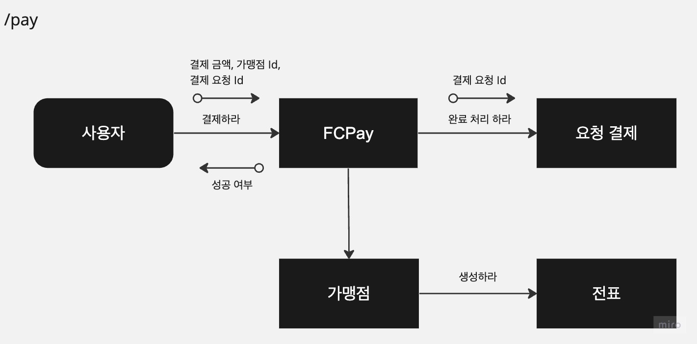
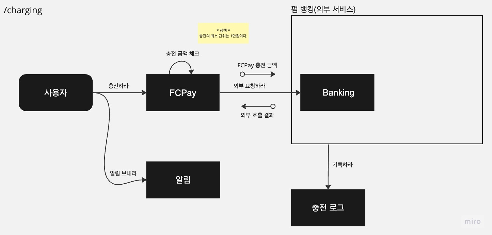

## 패캠 멘토링 미션

### 개발 환경
* IntelliJ IDEA 2023.1.5 (Ultimate Edition)
* Spring boot 3.2 , Spring-data-jpa 3.2.0
* Kotlin 1.9.20 , JDK 17
* KoTest
    * 인텔리제이 플러그인 설치 권장
* Gradle 8.5
* MySQL 8.0
  * 최초 실행시 user 권한 등록 필요

### 실행 방법
* make up - 도커 이미지 생성 및 docker-compose 실행
  * ./gradlew docker
  * docker-compose up -d
* make down - 도커 컨테이너 종료 및 이미지 삭제
  * docker-compose down --remove-orphans

### 요구 사항
* 가맹점에서는 "1만원 결제 요청" 이라는 것을 생성할 수 있습니다.
* 사용자는 해당 결제 요청에 대해서 다음 정보를 확인할 수 있습니다.
  * 결제 가맹점 명
  * 결제 금액
* 사용자는 해당 결제 요청에 대해서 결제가 가능합니다.
  * 성공/실패 여부
* 각 유저는 현재 자신이 결제 가능한 금액이 충전되어 있습니다.
  * 금액이 부족하면 결제가 실패할 수 있습니다.
* 사용자의 인증은 이미 되어있다고 가정하고 사용자의 ID로 대체합니다.
* 한번 결제가 된 요청은 다시 성공하면 안됩니다.

### 흐름
* /pay API 

* /charge API

